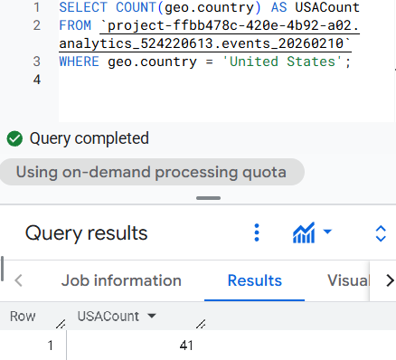
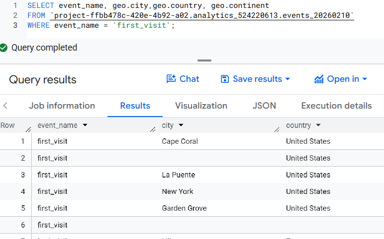
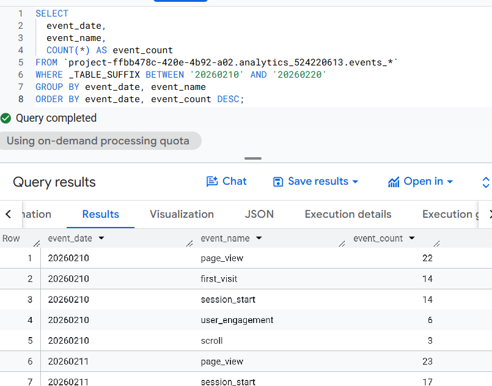
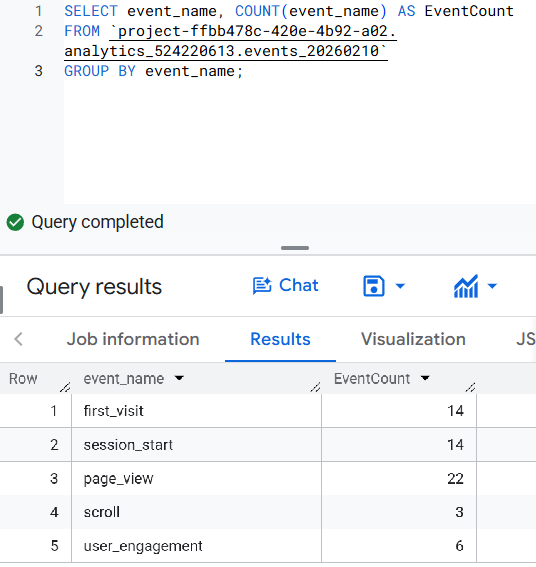
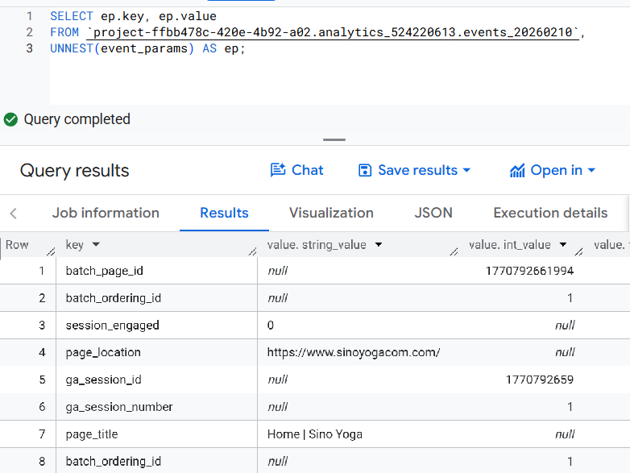
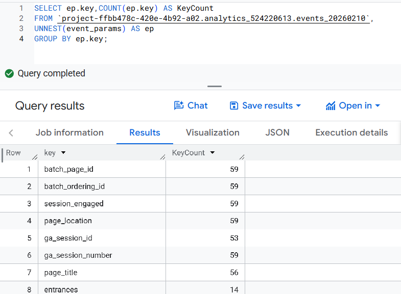
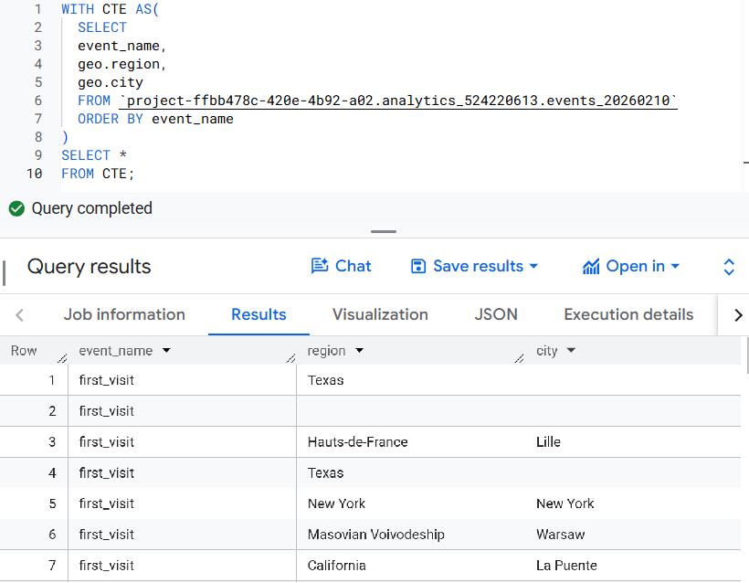
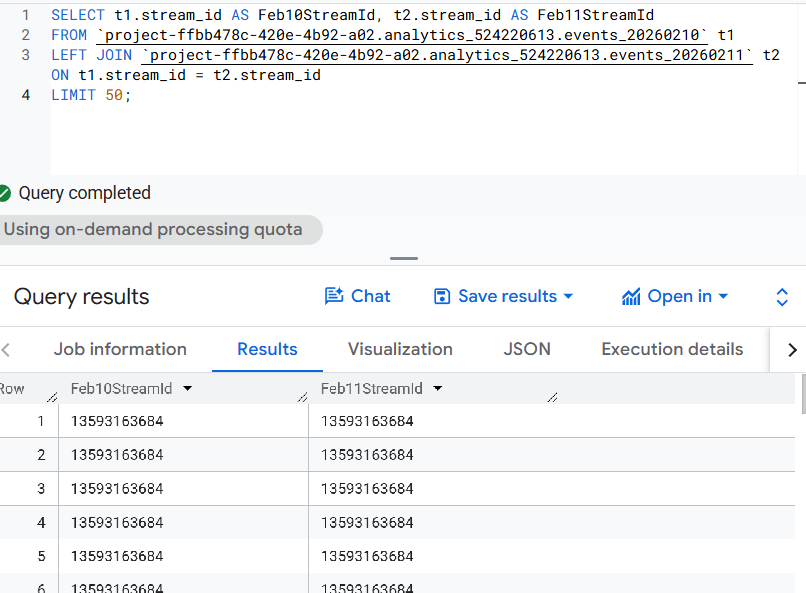

## Query 1

### WHERE Query 1

```` sql
```sql
SELECT COUNT(geo.country) AS USACount 
FROM `project-ffbb478c-420e-4b92-a02.analytics_524220613.events_20260210`
WHERE geo.country = 'United States';
```
````

### Reflection 1

This a really simple query showing how many times all events occurred from the United States for the event day of February 10,2026. Showing just one output of 41 with a variable called USACount.



## Query 2

### WHERE Query 2

```` sql
```sql
SELECT event_name, geo.city,geo.country, geo.continent 
FROM `project-ffbb478c-420e-4b92-a02.analytics_524220613.events_20260210` 
WHERE event_name = 'first_visit';
```
````

### Reflection 2

This query using the WHERE function selects from the dataset events from February 10, 2026 the event first_visit, and which cities are being shown as well as how many visits from users in those cities occured.



## Query 3

### GROUP BY Query 1

```` sql
```sql
SELECT 
  event_date,
  event_name,
  COUNT(*) AS event_count
FROM `project-ffbb478c-420e-4b92-a02.analytics_524220613.events_*`
WHERE _TABLE_SUFFIX BETWEEN '20260210' AND '20260220'
GROUP BY event_date, event_name
ORDER BY event_date, event_count DESC;
```
````

### Reflection 3

This query shows a table with event_date, event_name, and event_count between 10 days of data ordered by event date and showing the count of the events being executed by day and name. Showing data from February 10 -February 20 in Descending data.



## Query 4

### GROUP BY Query 2

```` sql
``` sql
SELECT event_name, COUNT(event_name) AS EventCount
FROM `project-ffbb478c-420e-4b92-a02.analytics_524220613.events_20260210` 
GROUP BY event_name;
```
````

### Reflection 4

The query for the GROUP BY function shows the results of the event_name and how many times that event has occured during the table. Such results displays how well each event id during this day.



## Query 5

### UNNEST Query 1

```` sql
```sql
SELECT ep.key, ep.value
FROM `project-ffbb478c-420e-4b92-a02.analytics_524220613.events_20260210`,
UNNEST(event_params) AS ep;
```
````

### Reflection 5

This UNNEST query shows the event parameters unnested and the values inside those key event parameters. In this case nothing is being grouped or counted just showing results however they each have different values whether that is a string or integer value for each event parameter.



## Query 6

### UNNEST Query 2

```` sql
``` sql
SELECT ep.key,COUNT(ep.key) AS KeyCount
FROM `project-ffbb478c-420e-4b92-a02.analytics_524220613.events_20260210`,
UNNEST(event_params) AS ep
GROUP BY ep.key;
```
````

### Reflection 6

This UNNEST query shows the different event parameters from the event table from February 10, 2026. the event_parameters are nested so using UNNEST we can see the different parameters that occured during that day and also count how many times those event_parameters occured throughout the day. Grouping the event by ep.key when displayed in the results



## Query 7

### CTE Query

```` sql
```sql
WITH CTE AS(
  SELECT 
  event_name, 
  geo.region,
  geo.city
  FROM `project-ffbb478c-420e-4b92-a02.analytics_524220613.events_20260210`
  ORDER BY event_name
)
SELECT *
FROM CTE;
``` 
````

### Reflection 7

The query creates a CTE to show a new table selecting certain data fields then showing all the fields in the new CTE dataset. Creating a new table called CTE with three variables event_name, geo.region, and geo.city. This new table is ordered by event_name to show different cities and regions the events are happening on the web site.



## Query 8

### JOINING Query

```` sql
```sql
SELECT t1.stream_id AS Feb10StreamId, t2.stream_id AS Feb11StreamId
FROM `project-ffbb478c-420e-4b92-a02.analytics_524220613.events_20260210` t1
LEFT JOIN `project-ffbb478c-420e-4b92-a02.analytics_524220613.events_20260211` t2 ON t1.stream_id = t2.stream_id
LIMIT 50;
```
````

### Reflection 8

This query using the mockup Sino Yoga website shows 50 stream_ids from both February 10, 2025, and February 11, 2025. The query uses LEFT JOIN to locate the stream_id from both tables and then aliases the two tables to join them on stream_id and limits the results to 50 shown.


